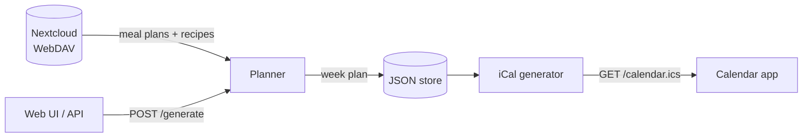

# ChefCal

[](https://github.com/aaronjauregui/chefcal/actions/workflows/ci.yml)
[](go.mod)
[](LICENSE)

A Go web service that generates weekly meal plans from recipes stored in Nextcloud and serves them as an iCal calendar feed. Subscribe to the feed from Nextcloud (or any calendar app) to see your dinner schedule and shopping list.

## Features

- **Nextcloud Cookbook integration.** Reads recipes over WebDAV (read-only) using the Cookbook app's standard layout.
- **Themed meal plans.** Plain Markdown files define the pool of recipes to pick from.
- **Timed dinner events.** Each event starts early enough for the recipe's total time to finish by your target dinner time.
- **Weekly shopping list.** One calendar event aggregates every ingredient for the week.
- **Standard iCal feed.** Works with Nextcloud Calendar, Google Calendar, Apple Calendar, Thunderbird, and others.
- **Minimal footprint.** A single Go binary with two direct dependencies and a JSON file for storage, plus a small Docker image.

## How It Works



1. ChefCal connects to your Nextcloud instance via WebDAV (read-only)
2. It reads meal plan files (`.md`) that list recipe names, and recipe data (`recipe.json`) from your Nextcloud directories
3. When you generate a week, it randomly picks 7 distinct recipes from the chosen meal plan and assigns one per day (Saturday–Friday)
4. Each dinner event is timed so that cooking finishes by 18:30 (configurable), with the start time calculated from the recipe's total prep/cook time
5. A shopping list event is created on Saturday at noon (configurable) containing all aggregated ingredients for the week
6. The calendar is served as a standard `.ics` feed that any calendar app can subscribe to

## Nextcloud Directory Structure

ChefCal uses the default layout from the [official Cookbook app](https://github.com/nextcloud/cookbook/). Thus, ChefCal expects the following layout in your Nextcloud files:

```
/Meal Plans/
  Japanese Chicken.md
  Comfort Food.md
  ...
/Recipes/
  Rindergoulasch/
    recipe.json
  French Onion Soup/
    recipe.json
  ...
```

### Meal Plan Files

Markdown files listing one recipe name per line. Lines starting with `#` are ignored.

```markdown
# Weekly comfort food
Rindergoulasch
French Onion Soup
Oyakodon
```

The recipe names must match directory names under `/Recipes/`. A meal plan needs at least 7 valid recipes to fill a week.

### Recipe Files

JSON files following the schema.org `Recipe` format. The fields used by ChefCal are:

```json
{
  "name": "Rindergoulasch",
  "description": "German-style goulash stew",
  "totalTime": "PT1H10M0S",
  "recipeIngredient": [
    "700g stewing beef",
    "1 tablespoon oil",
    "..."
  ]
}
```

- `totalTime` — ISO 8601 duration used to calculate when cooking should start (defaults to 30 minutes if missing or unparseable)
- `recipeIngredient` — used for dinner event descriptions and the weekly shopping list

## Getting Started

### Prerequisites

- Go 1.22 or later
- A Nextcloud instance with WebDAV access

### Build and Run

```bash
go build -o chefcal .
cp config.yaml.example config.yaml
# Edit config.yaml with your Nextcloud credentials
./chefcal -config config.yaml
```

Or run directly:

```bash
go run . -config config.yaml
```

### Docker

```bash
docker build -t chefcal .
docker run -p 8080:8080 -v ./config.yaml:/config.yaml -v ./data:/data chefcal
```

### Configuration

Copy `config.yaml.example` and edit it:

```yaml
server:
  address: ":8080"

nextcloud:
  url: "https://your-nextcloud.example.com/remote.php/dav/files/username"
  username: "your-username"
  password: "your-password"
  meal_plans_path: "/Meal Plans"
  recipes_path: "/Recipes"
  insecure_skip_verify: false  # set to true for self-signed certificates

planner:
  dinner_done_by: "18:30"
  shopping_event_time: "12:00"
  shopping_event_day: "Saturday"
  timezone: "Australia/Sydney"

store:
  path: "data/weeks.json"
```

| Key | Description | Default |
|-----|-------------|---------|
| `server.address` | Listen address | `:8080` |
| `nextcloud.url` | WebDAV root URL for your Nextcloud user | (required) |
| `nextcloud.username` | Nextcloud username | (required) |
| `nextcloud.password` | Nextcloud password or app token | (required) |
| `nextcloud.meal_plans_path` | Path to meal plan files | `/Meal Plans` |
| `nextcloud.recipes_path` | Path to recipe directories | `/Recipes` |
| `nextcloud.insecure_skip_verify` | Skip TLS certificate verification (for self-signed certs) | `false` |
| `planner.dinner_done_by` | Target time for dinner to be ready | `18:30` |
| `planner.shopping_event_time` | Time for the shopping list event | `12:00` |
| `planner.shopping_event_day` | Day of week for the shopping list event | `Saturday` |
| `planner.timezone` | IANA timezone for calendar events | `Australia/Sydney` |
| `store.path` | Path to the JSON file storing generated weeks | `data/weeks.json` |

## API Endpoints

| Method | Path | Description |
|--------|------|-------------|
| `GET` | `/` | Web UI for viewing current plans and generating new ones |
| `GET` | `/calendar.ics` | iCal feed — subscribe to this from Nextcloud or any calendar app |
| `GET` | `/plans` | JSON array of available meal plan names |
| `POST` | `/generate?plan=Name` | Generate a meal plan for the next available week. Omit `plan` to pick a random meal plan file |

### Subscribing in Nextcloud

1. Start ChefCal on your network
2. In Nextcloud, go to the Calendar app
3. Click "New subscription from link (read-only)"
4. Enter `http://<chefcal-host>:8080/calendar.ics`

The calendar will show dinner events for each day of the generated week(s) and a shopping list event on Saturday.

### Generating a Week

From the web UI at `/`, select a meal plan (or leave it on "Random") and click "Generate Next Week".

Or via the API:

```bash
# Generate with a specific meal plan
curl -X POST 'http://localhost:8080/generate?plan=Japanese%20Chicken'

# Generate with a random meal plan
curl -X POST http://localhost:8080/generate
```

The response includes the week start date, chosen plan, and daily meals:

```json
{
  "week_start": "2026-04-11",
  "plan": "Japanese Chicken",
  "days": [
    {"date": "Saturday, Apr 11", "recipe": "Oyakodon"},
    {"date": "Sunday, Apr 12", "recipe": "Karaage"}
  ]
}
```

If next week already has a plan, the service automatically targets the week after.

## Data Persistence

Generated week plans are stored in a JSON file (configured via `store.path`). Past weeks are automatically cleaned up — only current and upcoming weeks are kept.

## Development

The `Makefile` wraps the common tasks:

| Command | Description |
|---------|-------------|
| `make build` | Build the `chefcal` binary |
| `make run` | Build and run with `config.yaml` |
| `make test` | Run all tests with the race detector |
| `make test-cover` | Run tests and print per-function coverage |
| `make lint` | Run `go vet`, a `gofmt` check, and [`golangci-lint`](https://golangci-lint.run/) |
| `make fmt` | Format all Go files in place |
| `make docker` | Build the Docker image |

CI runs the build, formatting and `go mod tidy` checks, vet, tests, lint, and a Docker build on every push and pull request.

### Project Layout

```
.
├── main.go               # Entry point: loads config and wires up components
└── internal/
    ├── config/           # YAML config loading and defaults
    ├── model/            # Shared domain types and the RecipeSource interface
    ├── nextcloud/        # WebDAV client for reading meal plans and recipes
    ├── planner/          # Week generation, dinner timing, ISO 8601 durations
    ├── ical/             # RFC 5545 calendar feed generation
    ├── store/            # JSON-file persistence with atomic writes
    └── server/           # HTTP handlers and the web UI
```

## License

[MIT](LICENSE)
